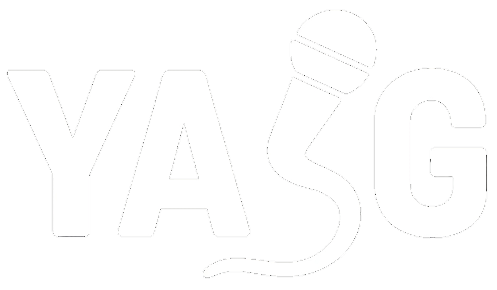

    <picture>
        
    </picture>

    <i>YASG (Yet Another Singing Game)</i>

<video src="https://github.com/user-attachments/assets/34665318-e107-4581-8e10-cab439f1beab" width="50%" autoplay controls></video>

---

> [!WARNING]
> **YASG is currently in its early beta stage.**  
> As such, you may encounter **various bugs, unexpected behavior and missing features** while playing.  
> If you discover any issues, please report them by creating an issue on the [GitHub Issues page](https://github.com/grncd/YASG/issues).

---

## 🧭 Overview

**YASG (Yet Another Singing Game)** is a karaoke game designed to make singing simple and fun.  
Unlike most karaoke games that restrict you to a set of playable songs / require manual work, **you don’t need to download songs or lyrics manually.** A quick search lets you play any track available on major digital streaming platforms (DSPs).

YASG analyzes your **voice pitch in real time**, compares it to the original singer’s, and **awards points based on accuracy.**
At the moment, YASG supports up to 4 players **locally**. Online mode is still being worked on.

---

# 🔽 [DOWNLOAD HERE](https://github.com/grncd/YASG/releases/download/v0.0.1b/Build.zip)
> **Currently Windows-only**

---

## ⚙️ Installation

1. Download the latest release from the [Releases page](https://github.com/grncd/YASG/releases).  
2. Extract the contents of **Build.zip**.  
3. Run **YASG.exe** — the game will handle everything automatically.

---

## 🐛 Reporting Issues & Feedback

If you encounter bugs, crashes, or have feature suggestions, please open an issue on the  
➡️ [GitHub Issues page](https://github.com/grncd/YASG/issues)

When reporting a bug, include:
- A brief description of the issue  
- Steps to reproduce it (if possible)  
- Any relevant screenshots or error messages
- Your system specifications (CPU, GPU, etc.)

---

## 🖥️ Building from Source (for contributors)

To build YASG from source:

1. Clone this repository.  
2. Open the project in **Unity 2021.3.21f1** or newer.  
3. That’s it — no additional setup is required.

---

## 📜 Disclaimer

YASG relies on several open-source projects to function.  
These tools are not included with the game but are automatically installed within the game’s Python environment.

**Special thanks to the developers of the following projects:**

* [**syrics**](https://github.com/akashrchandran/syrics) – Main source for synced lyrics.  
* [**spotDL**](https://github.com/spotDL/spotify-downloader) – Handles song downloading.  
* [**demucs**](https://github.com/adefossez/demucs) and [**vocalremover.org**](https://vocalremover.org/) – Used for vocal/instrumental separation.  
* [**LRCLib**](https://lrclib.net/) – Provides fallback and custom lyric database support.

---

## 📄 License

This project is licensed under the [MIT License](LICENSE).  
You are free to use, modify, and distribute this software under the terms of the license.
