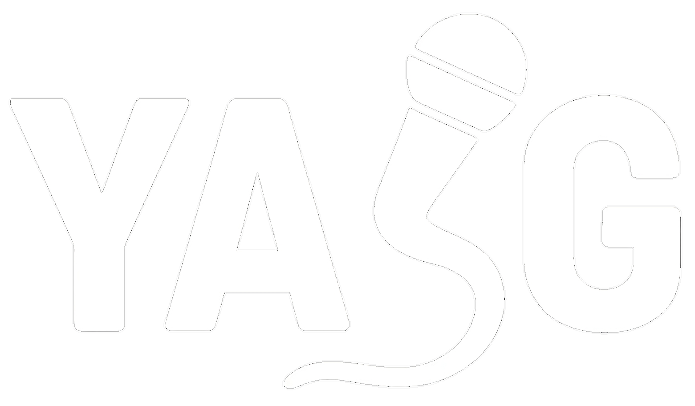

    <picture>
        
    </picture>

    <i>YASG (Yet Another Singing Game)</i>

<video src="https://github.com/user-attachments/assets/34665318-e107-4581-8e10-cab439f1beab" width="50%" autoplay controls></video>

---

> [!WARNING]
> **YASG is currently in its early beta stage.**  
> As such, you may encounter **various bugs, unexpected behavior and missing features** while playing.  
> If you discover any issues, please report them by creating an issue on the [GitHub Issues page](https://github.com/grncd/YASG/issues).

---

## 🧭 Overview

**YASG (Yet Another Singing Game)** is a karaoke game designed to make singing simple and fun.  
Unlike most karaoke games that restrict you to a set of playable songs / require manual work, **you don’t need to download songs or lyrics manually.** A quick search lets you play any track available on major digital streaming platforms (DSPs).

YASG analyzes your **voice pitch in real time**, compares it to the original singer’s, and **awards points based on accuracy.**
At the moment, YASG supports up to 4 players **locally** or **remotely** via the Online mode.

---

## ℹ️ Information
- Holding **ESC** at the menu exits the game
- Pressing **Ctrl+I** at the menu allows you to **import custom songs using .zip files**
- Upon creating a custom song, the .zip will be saved to %APPDATA%/YASG/YASG/customSongs

---

# 🔽 [DOWNLOAD HERE](https://github.com/grncd/YASG/releases/tag/v0.1.1b)
> **Currently supports Windows, Linux and Android.**

---

## 🐛 Reporting Issues & Feedback

If you encounter bugs, crashes, or have feature suggestions, please open an issue on the  
➡️ [GitHub Issues page](https://github.com/grncd/YASG/issues)

---

## Building from Source (for contributors)

To build YASG from source:

1. Clone this repository.  
2. Open the project in **Unity 6000.3.2f1** or newer.  
3. That’s it, no additional setup is required. (i think)

---

## Disclaimer

YASG relies on several open-source projects to function.  

**Special thanks to the developers of the following projects:**

* [**YouTubeExplode**](https://github.com/Tyrrrz/YoutubeExplode) and [**yt-dlp**](https://github.com/yt-dlp/yt-dlp) - Used for downloading songs from YouTube.
* [**LRCLib**](https://lrclib.net/) - Main source for synced lyrics.   
* [**demucs**](https://github.com/adefossez/demucs) and [**vocalremover.org**](https://vocalremover.org/) - Used for vocal/instrumental separation.
*  [**FishNet**](https://github.com/FirstGearGames/FishNet) - Library used for Multiplayer.
